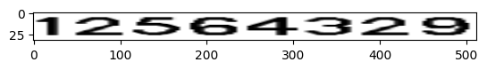
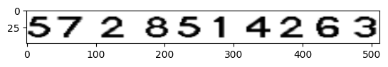

# digitgen

A Synthetic Text Image generator for Regular Scene text Detection.





## Installation

### 1. From PIP

$`pip install ImgAnn`

### 2. From github
clone the codebase from GitHub
```
$ git clone https://github.com/ACRA-FL/digitgen.git
```
build the library
```
$ python setup.py bdist_wheel sdist
$ pip install -e .
```
## Documentation.

* Check the NoteBook in Docks Folder named [Digitgen_Examples.ipynb](Docs/Digitgen_Examples.ipynb)
* This Document Contains all the basic use cases.

